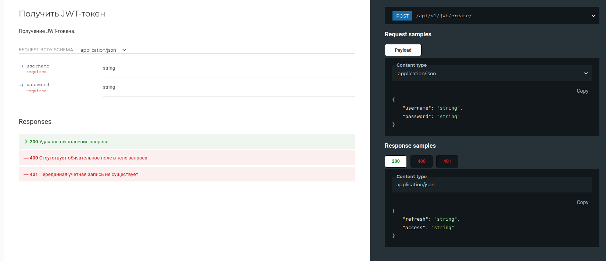
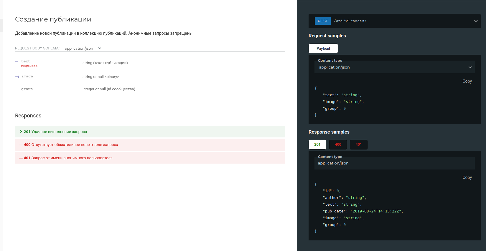
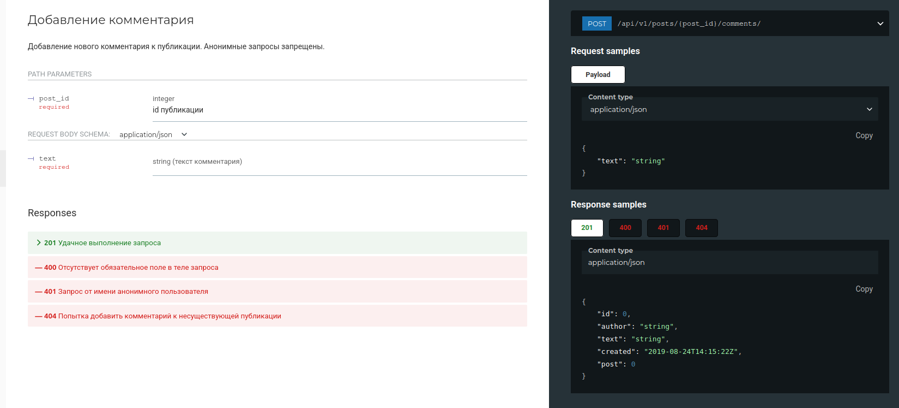
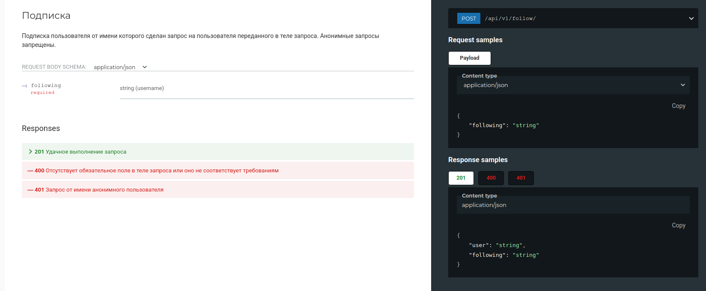

# Описание
Проект представляет собой платформу для обсуждений, где пользователи могут общаться на различные темы. У каждого есть профиль с возможностью публикации постов. Другие участники могут комментировать записи, а также подписываться на понравившихся авторов.
# Установка
### Как запустить проект:

Клонировать репозиторий и перейти в него в командной строке:

```
git clone https://github.com/mishIgr/api_final_yatube.git
```

```
cd yatube_api
```

Cоздать и активировать виртуальное окружение:

```
python3.10 -m venv env
```

```
source env/bin/activate
```

Установить зависимости из файла requirements.txt:

```
python3 -m pip install --upgrade pip
```

```
pip install -r requirements.txt
```

Выполнить миграции:

```
python3 manage.py migrate
```

Или выполните миграции с заполнением бд:

```
./postman_collection/set_up_data.sh
```

Запустить проект:

```
python3 manage.py runserver
```
# Примеры

- Получение токена



- Создание публикации



- Создание комментария



- Подписка на пользователя


